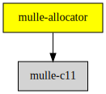

# mulle-allocator

#### 🔄 Flexible C memory allocation scheme

... provides a way to pass around the memory scheme du jour

... has identical API to malloc, realloc, free

... frees your code from having to check for errors when allocating memory

... contains a safer and portable alloca

**mulle-allocator** has a companion project: [mulle-testallocator](//github.com/mulle-core/mulle-testallocator).
*mulle-testallocator* provides the error and leak detection, that was formerly a part of mulle-allocator..


| Release Version                                       | Release Notes  | AI Documentation
|-------------------------------------------------------|----------------|---------------
|  [](//github.com/mulle-c/mulle-allocator/actions)  | [RELEASENOTES](RELEASENOTES.md) | [DeepWiki for mulle-allocator](https://deepwiki.com/mulle-c/mulle-allocator)


## API

* [Allocator](dox/API_ALLOCATOR.md)


## Use `mulle_malloc` instead of `malloc` to reduce code size

Instead of:

``` c
   if( ! malloc( 1848))
   {
      perror( "malloc:");
      exit( 1);
   }
   if( ! calloc( 18, 48))
   {
      perror( "calloc:");
      exit( 1);
   }
   s = strdup( "VfL Bochum 1848");
   if( ! s)
   {
      perror( "strdup:");
      exit( 1);
   }
   if( ! realloc( s, 18);
   {
      perror( "realloc:");
      exit( 1);
   }
   free( s);
```

write

``` c
   mulle_malloc( 1848);
   mulle_calloc( 18, 48);
   s = mulle_strdup( "VfL Bochum 1848");
   mulle_realloc( s, 18);
   mulle_free( s);
```

You don't have to check for out of memory error conditions anymore.
Otherwise your code will run the same and a possible performance
degradation because of the indirection will be hardly measurable.


### How mulle-allocator deals with memory shortage

By the C standard `malloc` returns **NULL** and sets `errno` to `ENOMEM`, if
it can't satisfy the memory request. Here are the two most likely scenarios why
this happens:

The caller specified a huge amount of memory, that the OS can't give you.
Typically (size_t) -1 can never work. This is considered to be a bug on the
callers part.

Or the program has exhausted all memory space available to the process. Here
is what happens on various OS:

| OS       |  malloc fate
|----------|-------------------------------------------
| FreeBSD  | `malloc` hangs, probably waiting for memory to become available
| MacOS X  | `malloc` slowly brings the system to a crawl, no error observed
| Linux    | `malloc` returns an error
| Windows  | unknown

The gist is, that in portable programs it doesn't really make sense to rely
on `malloc` returning **NULL** and doing something clever based on it.

If we define the mulle-allocator malloc to always return a valid memory
block - discounting erroneous parameters as programmers error, to be caught
during development - then memory calling code simplifies from:

``` c
   p = malloc( size);
   if( ! p)
      return( -1);
   memcpy( p, q, size);
```

to

``` c
   p = mulle_malloc( size);
   memcpy( p, q, size);
```

##  Use `mulle_allocator` to make your code more flexible

You can make your code, and especially your data structures, more flexible by
using a `mulle_allocator`. This decouples your data structure from **stdlib**.
It enables your data structure to reside in shared or wired memory
with no additional code. Your API consumers just have to pass their own
allocators.

Also it can be helpful to isolate your data structure memory allocation during
tests. This way, other, possibly benign, code leaks, do not obscure the test.


### What is an allocator ?

The `mulle_allocator` struct is a collection of function pointers, with one
added pointer for `aba` and looks like this:

``` c
struct mulle_allocator
{
   void   *(*calloc)( size_t n, size_t size, struct mulle_allocator *p);
   void   *(*realloc)( void *block, size_t size, struct mulle_allocator *p);
   void   (*free)( void *block, struct mulle_allocator *p);
   void   (*fail)( struct mulle_allocator *p, void *block, size_t size) MULLE_C_NO_RETURN;
   int    (*abafree)( void *aba, void (*free)( void *), void *block);
   void   *aba;
};
```

> By default `.aba` and `.abafree` are not available.
> If you need ABA safe freeing, it is recommended to use [mulle-aba](//github.com/mulle-concurrent/mulle-aba).

You should not jump through the vectors directly, but use
supplied inline functions like `mulle_allocator_malloc`, as they perform the
necessary return value checks (see below: Dealing with memory shortage).

The shortcut functions like `mulle_malloc` use the `mulle_default_allocator`
by default and save you some type-work. You can also use `NULL` as the
allocator for `mulle_allocator_malloc` with the same effect as choosing
the `mulle_default_allocator`.


#### Embedding the allocator in your data structure

A pointer to the allocator could be kept in your data structure. This
simplifies your API, as the allocator is only needed during creation. Here is
an example how to use the allocator in this fashion:

``` c
struct my_string
{
   struct mulle_allocator   *allocator;
   char                     s[ 1];
};


struct my_string   *my_string_alloc( char *s, struct mulle_allocator *allocator)
{
   size_t              len;
   struct my_string    *p;

   len = s ? strlen( s) : 0;
   p   = mulle_allocator_malloc( allocator, sizeof( struct my_string) + len);
   dst->allocator = allocator;
   memcpy( p->s, s, len);
   p->s[ len] = 0;
   return( p);
}


static inline void   my_string_free( struct my_string *p)
{
   mulle_allocator_free( p->allocator, p);
}

```

#### Not embedding the allocator in your data structure

But if you don't want to store the allocator inside the data structure, you
can pass it in again:

``` c
struct my_other_string
{
   char   s[ 1];
};


struct my_other_string   *my_other_string_alloc( char *s, struct mulle_allocator *allocator)
{
   size_t                    len;
   struct my_other_string    *p;

   len = s ? strlen( s) : 0;
   p   = mulle_allocator_malloc( allocator, sizeof( struct my_other_string) + len);
   memcpy( p->s, s, len);
   p->s[ len] = 0;
   return( p);
}


static inline void   my_other_string_free( struct my_other_string *p,
                                           struct mulle_allocator *allocator)
{
   mulle_allocator_free( allocator, p);
}
```

The disadvantage is, that this opens the door for bugs, as you may be using
different allocators accidentally.


## Use `mulle_alloca_do` like a better alloca

mulle-allocator provides the `mulle_alloca_do` macro for stack based
storage, that gets swapped to heap based when the size exceeds a certain
compile time size.

> #### What is `alloca` ? Excerpts from `man alloca`
>
> The alloca() function allocates size bytes of space in the stack frame
> of the caller. This temporary space is automatically freed    the
> function that called alloca() returns to its caller... There is no error
> indication, if the stack frame cannot be extended... For certain applications,
> its use can improve efficiency compared to the use of malloc plus free...
> Otherwise, its use is discouraged...

Here is an example function, where the use of `alloca` avoids a `malloc`
and `free` call. Getting stack space is super cheap and the
automatic reclamation makes the code easier to write:

``` c
void  print_uppercase( char *s)
{
   char     *copy;
   size_t   i;
   size_t   len;

   len  = strlen( s) + 1;
   copy = alloca( len);

   for( i = 0; i < len; i++)
     copy[ i] = toupper( s[ i]);

   printf( "%s\n", copy);
}

```

The problems are two-fold: `alloca` may not be available (or is
"hidden" in a non standard header, which decreases portability). The length
of `s` is unknown and the available stack size is also unknown. So this code
is likely to crash for large strings. How large ? Hard to say...

`mulle_alloca_do` uses a certain safe amount (the default is 128 bytes) of
stack space for a temporary allocation.


> ### Note
>
> What is a safe amount ? The author thinks `double[8]` should be fine.
> If your system is very tiny or very large, you can set MULLE_ALLOCA_STACKSIZE
> to a size of your liking. Remember though, that if you call other functions
> that also use `mulle_alloca_do` the reasonable stack size is halved (and
> so on). Use `mulle_alloca_do_flexible` if you want to set the stack size
> per macro invocation.
>

But if the requests exceeds this amount `mulle_alloca_do` will fallback to
malloc/free. See above code transformed to `mulle_alloca_do`:

``` c
void  print_uppercase( char *s)
{
   // char     *copy;  // no longer needed, will be declared in mulle_alloca_do
   size_t   i;
   size_t   len;

   len  = strlen( s) + 1;
   mulle_alloca_do( copy, char, len) // need type to alloca for alignment
   {
      for( i = 0; i < len; i++)
        copy[ i] = toupper( s[ i]);

      printf( "%s\n", copy);
   }
}
```

The scope of `copy` is now tied to `mulle_alloca_do` and not the function!

``` c
/* copy not yet in scope */

mulle_alloca_do( copy, char, size)
{
   /* code block, where copy is valid */
}

/* copy no longer in scope (and freed) */
```

There is quite a lot more to read about `mulle_alloca_do`, so check out the
header [mulle-alloca.h](src/mulle-alloca.h) for more details, including
`break` protection.


## Caveats

The `mulle_default_allocator` and `mulle_stdlib_allocator` never return, if the
allocation went bad. If a mulle-allocator function detects, that an allocation
could not be satisfied, it jumps through its fail vector. This will print an
error message and exit the program.

You can not pass a zero size to either `mulle_realloc` or `mulle_malloc`
without getting a failure. If you want to free memory with realloc - by
passing a zero block size - you need to use `mulle_realloc_strict`.
If you pass a zero block size and a zero block to `mulle_realloc_strict`, it
will return NULL.


### You are here




## Add

**This project is a component of the [mulle-core](//github.com/mulle-core/mulle-core) library. As such you usually will *not* add or install it
individually, unless you specifically do not want to link against
`mulle-core`.**


### Add as an individual component

Use [mulle-sde](//github.com/mulle-sde) to add mulle-allocator to your project:

``` sh
mulle-sde add github:mulle-c/mulle-allocator
```

To only add the sources of mulle-allocator with dependency
sources use [clib](https://github.com/clibs/clib):


``` sh
clib install --out src/mulle-c mulle-c/mulle-allocator
```

Add `-isystem src/mulle-c` to your `CFLAGS` and compile all the sources that were downloaded with your project.


## Install

Use [mulle-sde](//github.com/mulle-sde) to build and install mulle-allocator and all dependencies:

``` sh
mulle-sde install --prefix /usr/local \
   https://github.com/mulle-c/mulle-allocator/archive/latest.tar.gz
```

### Legacy Installation

Install the requirements:

| Requirements                                 | Description
|----------------------------------------------|-----------------------
| [mulle-c11](https://github.com/mulle-c/mulle-c11)             | 🔀 Cross-platform C compiler glue (and some cpp conveniences)

Download the latest [tar](https://github.com/mulle-c/mulle-allocator/archive/refs/tags/latest.tar.gz) or [zip](https://github.com/mulle-c/mulle-allocator/archive/refs/tags/latest.zip) archive and unpack it.

Install **mulle-allocator** into `/usr/local` with [cmake](https://cmake.org):

``` sh
cmake -B build \
      -DCMAKE_INSTALL_PREFIX=/usr/local \
      -DCMAKE_PREFIX_PATH=/usr/local \
      -DCMAKE_BUILD_TYPE=Release &&
cmake --build build --config Release &&
cmake --install build --config Release
```


## Author

[Nat!](https://mulle-kybernetik.com/weblog) for Mulle kybernetiK  


